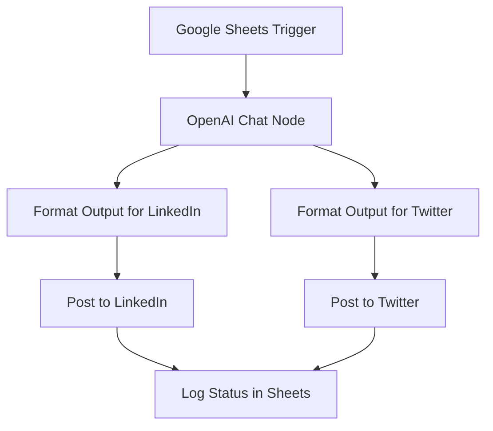

Got it 👍 — here’s the **full README.md in a single file** (you can copy-paste directly and replace your repo’s `README.md`):

---

```markdown
# 🚀 Content Automation with n8n  

[](https://n8n.io)  
[](https://openai.com)  
[](#)  
[](LICENSE)  

Automate your content pipeline with **n8n + OpenAI**:  
- 📝 Input from **Google Sheets**  
- 🤖 Summarization with **OpenAI**  
- 📢 Auto-posting to **LinkedIn & Twitter (X)**  
- 📊 Optional logging back to Sheets  

---

## 🌟 Features  
✅ Monitors Google Sheets for updates  
✅ Summarizes or rephrases text for social media  
✅ Posts directly to LinkedIn & Twitter  
✅ Keeps logs of posted content  
✅ 100% customizable & extendable  

---

## 🛠️ Tech Stack  
- [n8n](https://n8n.io) – Workflow automation  
- [OpenAI](https://platform.openai.com/) – AI text generation  
- [Google Sheets API](https://developers.google.com/sheets/api) – Data source  
- [Twitter API](https://developer.twitter.com/en/docs) – X posting  
- [LinkedIn API](https://learn.microsoft.com/en-us/linkedin/) – LinkedIn posting  

---

## 📂 Project Structure  
```

content-automation-with-n8n/
├── workflows/
│     └── content-automation-with-n8n.json
├── .gitignore
├── .env.example
└── README.md

````

---

## ⚡ Quick Start  

<details>
<summary>🔧 1. Clone Repository</summary>  

```bash
git clone https://github.com/Shiva1msk/content-automation-with-n8n.git
cd content-automation-with-n8n
````

</details>

<details>
<summary>📥 2. Import Workflow</summary>  

* Open n8n → Editor
* Click **Import workflow**
* Choose `workflows/content-automation-with-n8n.json`

</details>

<details>
<summary>🔑 3. Configure Environment</summary>  

Copy `.env.example` → `.env` and set your credentials:

```env
OPENAI_API_KEY=your_openai_api_key
GOOGLE_SERVICE_ACCOUNT_KEY=your_google_service_account_key
TWITTER_API_KEY=your_twitter_api_key
TWITTER_API_SECRET=your_twitter_secret
LINKEDIN_ACCESS_TOKEN=your_linkedin_access_token
```

</details>

<details>
<summary>🚀 4. Run with Docker</summary>  

```bash
docker run -it --rm \
  --name n8n \
  -p 5678:5678 \
  --env-file .env \
  -v n8n_data:/home/node/.n8n \
  n8nio/n8n
```

</details>

---

## 📈 Workflow Diagram



---

## 💡 Future Ideas

* ⏰ Add scheduling (Cron node)
* \#️⃣ Auto-generate hashtags
* 🌍 Auto-translate posts for multiple languages
* 🎭 Sentiment/tone-based content adjustment

---

## 🤝 Contributing

Pull requests welcome! If you’d like to improve this workflow, fork this repo and submit a PR.

---

## 📜 License

[MIT](LICENSE) – free to use & modify.

---

✨ Built with ❤️ using [n8n](https://n8n.io) + [OpenAI](https://openai.com)

```

---


```
